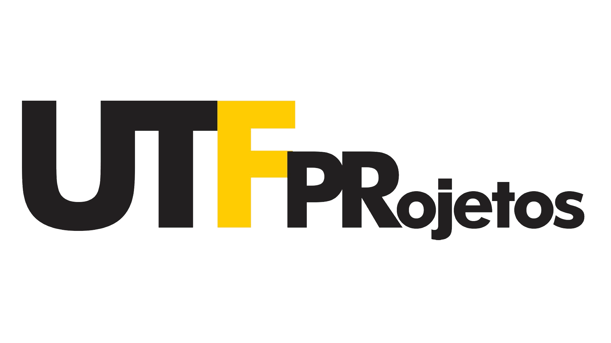

# Projeto feito na disciplina de Programação de Aplicativos

## 🚀 Tecnologias

- [ReactJS](https://pt-br.reactjs.org/)
- [Material UI](https://mui.com/pt/)
- [Styled Components](https://styled-components.com/)

## UTFPRojetos

O propósito do sistema é ajudar professores a criar bolsas e oportunidades
de estágio para os alunos, e os alunos terem acesso a essas vagas de estágio e
bolsas. Com isso os alunos são capazes de verem quais bolsas estão sendo
ofertadas dentro da UTFPR, por quais professores, assim como seus detalhes e
requisitos.

## Criadores que contribuiram para a realização do mesmo

### Front-end

- [iagosasaki](https://github.com/iagosasaki)
- [JoaquimCJunior](https://github.com/JoaquimCJunior)
- [William-Reticena](https://github.com/William-Reticena)

### Back-end

- [acacio90](https://github.com/acacio90)
- [Pedrobk222](https://github.com/Pedrobk222)
- [RyanRamos01](https://github.com/RyanRamos01)
